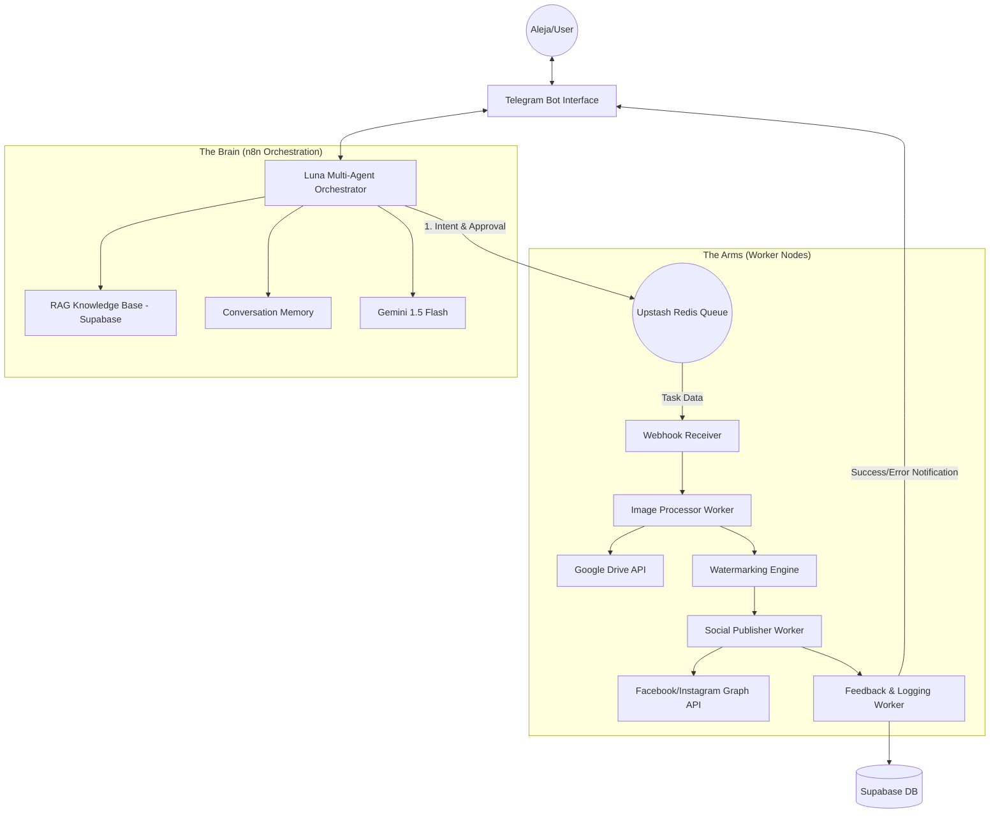
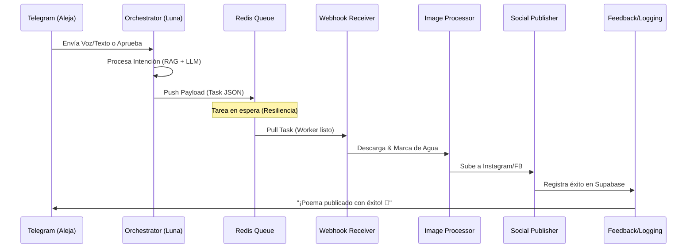
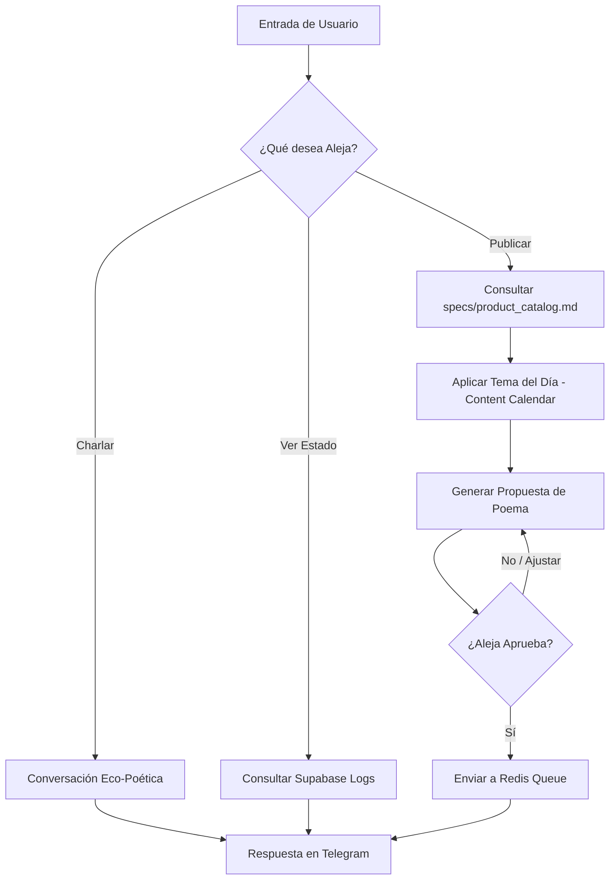

# System Architecture: Nenufar Marketing Automation
Version: v1.3

## Overview
The system follows an **n8n-First Orchestration** pattern, where the decision-making (Brain) and execution (Arms) are unified within a single automated ecosystem. It is designed to be resilient, scalable (within free-tier limits), and deeply aligned with the "Luna" brand persona.

---

## 1. System Topology

### 1.1 High-Level Architecture

---

## 2. Workflow Orchestration & Data Flow

### 2.1 Sequence of Execution (The Handshake)
Este diagrama muestra cómo los procesos asíncronos se comunican entre sí para garantizar que ninguna tarea se pierda.

### 2.2 Decision Logic: The Brain (Internal Luna Loop)
Cómo decide Luna qué acción tomar ante un mensaje de entrada.

---

## 3. Core Components

### 3.1 The Orchestrator (Luna Multi-Agent v2)
- **Role:** Central Mission Control.
- **Workflow:**
    1. **Input:** Receives text, voice, or media from Telegram.
    2. **Transcription:** Uses Whisper/Gemini for voice-to-text.
    3. **Strategy Retrieval:** Queries `luna-rag-knowledge-base` to get product specs and social narratives.
    4. **Generation:** Luna crafts a "Woven Poem" caption following the `specs/brand_essence.md` guidelines.
    5. **Human-in-the-Loop:** Presents the content and media preview to Aleja for approval.
    6. **Dispatch:** Upon approval, it sends a payload to the Webhook Receiver.

### 3.2 The Message Broker (Upstash Redis)
- **Role:** Asynchronous Backbone.
- **Function:** Decouples the low-latency Orchestrator from high-latency processing (image resizing, API calls). It ensures task persistence and allows for retries in case of worker failure.

### 3.3 The Infrastructure (GCP + Supabase)
- **n8n (GCP e2-micro):** Dockerized instance running in Queue Mode.
- **Supabase:** Acts as the "Long-Term Memory" (LTM).
    - `processed_files`: Tracks every asset's lifecycle.
    - `content_calendar`: Stores the 7-day marketing strategy.
    - `monitoring_logs`: System health metrics.

---

## 4. Operational Modes & Lifecycle

### 4.1 Proactive Discovery Mode (Heartbeat Triggered)
- **Drive Scan:** `luna-drive-monitor` busca nuevos activos.
- **Strategy Alignment:** Luna consulta el `content_calendar`.
- **Curation:** Luna selecciona y propone.

### 4.2 Lifecycle States Table

| State | Trigger | System Action | Output |
| :--- | :--- | :--- | :--- |
| **Pending** | Drive Sync | Record created in `processed_files` | Metadata en Supabase |
| **Drafting** | Heartbeat | Luna genera propuesta de caption | Mensaje en Telegram |
| **Processing**| User Approval| Redis Queue -> Image Processor | Imagen con Watermark |
| **Publishing**| Worker Success| Social Publisher -> Meta API | URL del Post en vivo |
| **Logged** | Completion | Feedback & Logging Worker | Confirmación Final |

