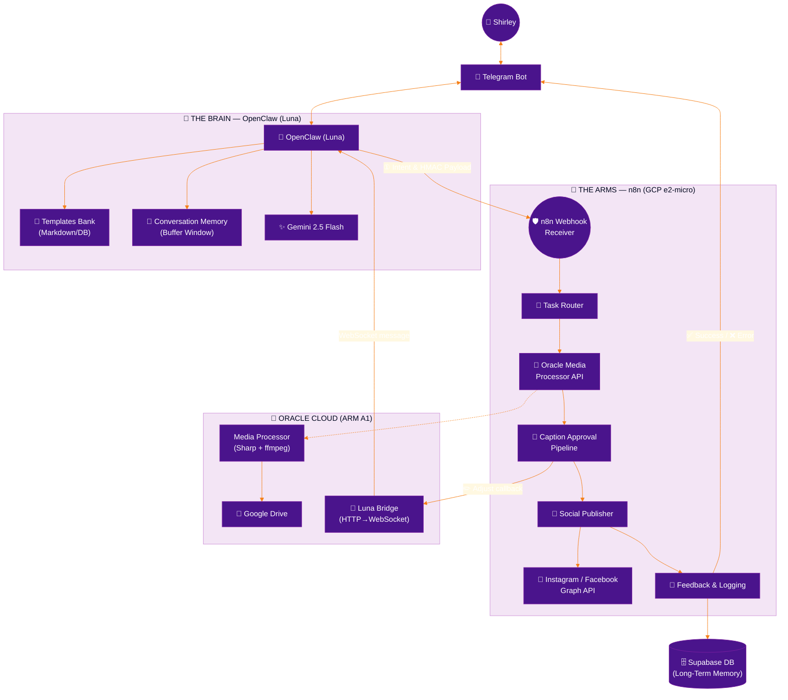
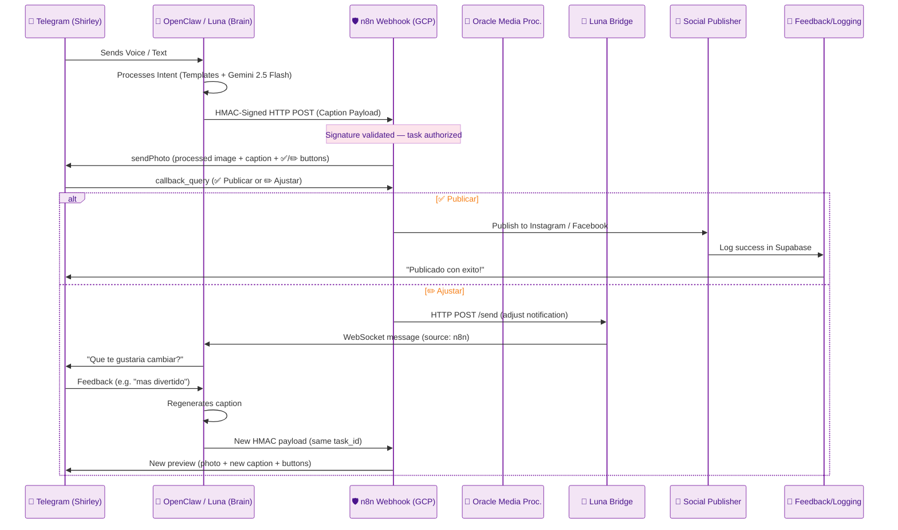
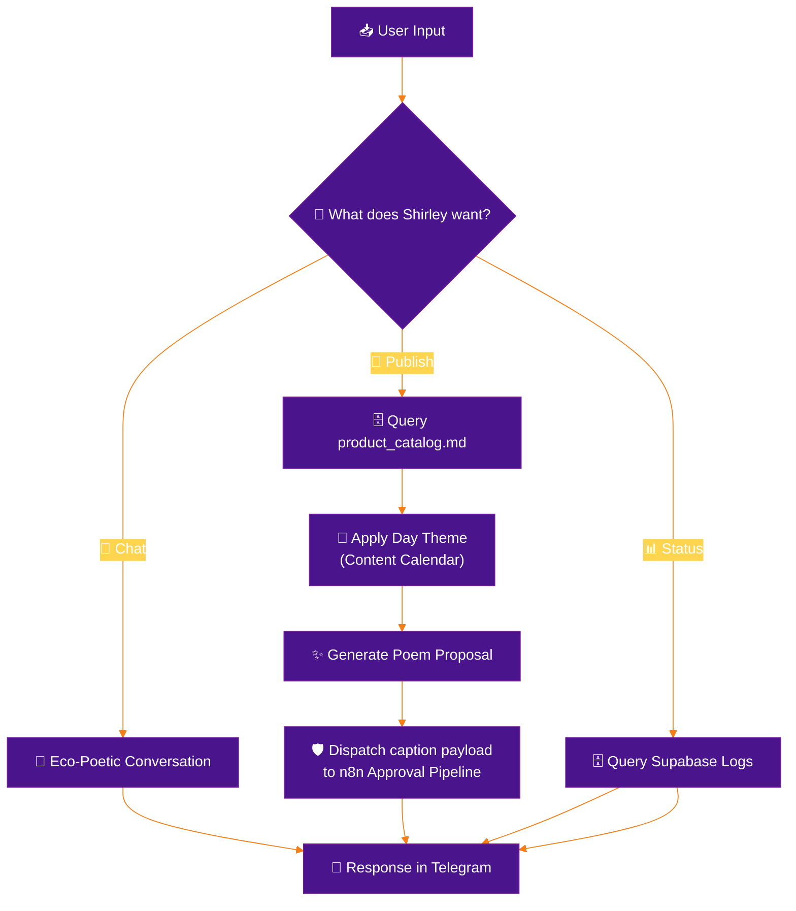

# System Architecture: Nenufar Marketing Automation
Version: v4.0
<!-- v4.0: n8n migrated from GCP e2-micro to Oracle Cloud. All components on single VM. Brain and Arms colocated. Luna Bridge removed — n8n communicates directly with OpenClaw via Telegram Bot API. Luna dispatches captions via dispatch-caption.js script. Media Processor on same VM. DuckDNS used for external domain only. -->
<!-- v2.9: Token optimization for Caption Approval Pipeline — predefined adjustment options, max 2 adjustments. Ref: ADR-005. -->
<!-- v2.8: Caption Approval Pipeline — 2 buttons (✅ Publicar / ✏️ Ajustar) instead of 3. n8n sends photo+caption preview. Adjust triggers feedback loop via Luna. -->
<!-- v2.7: Defined Drive folder structure (Input + Procesadas). Processed images stored in Drive, not Supabase. -->
<!-- v2.6: Fixed media flow — new files auto-processed without Telegram. Heartbeat only notifies if pipeline is empty. Logo from Drive. -->
<!-- v2.3: Explicit Video support and Daily Scheduling flow. -->
<!-- v2.2: Added Proactive Hybrid Flow section. Optimized for token saving. -->
<!-- v2.1: Major architectural correction. Brain = OpenClaw (Luna) communicating via Telegram with Gemini. Optimization: Shifted from RAG to Templates Bank to save tokens. Arms = n8n Workers. -->

## Overview
The system follows a **Brain-Arms pattern**: **OpenClaw (Luna)** is the Brain — the cognitive agent that thinks, selects the best content strategy, and communicates with the user via Telegram using Gemini 2.5 Flash + **Templates Bank**. **n8n** is the Arms — the execution layer that handles mechanical tasks (media processing, publishing, logging) via direct HMAC-signed webhooks. This separation ensures intelligence stays in the agent while automation stays in the workflows.

---

## 1. System Topology

### 1.1 Visual Workflow Architecture (ASCII)
```text
╔═══════════════════════════════════════════════════════════════╗
║  🌸  NENUFAR — LUNA SYSTEM ARCHITECTURE v4.0  🌸            ║
║  All components on single Oracle Cloud VM (132.145.73.80)    ║
╚═══════════════════════════════════════════════════════════════╝

 ┌─────────────────────────────────────────────────────────────┐
 │  🧠  THE BRAIN — OPENCLAW (LUNA)     [Oracle Cloud VM]     │
 │     AI Agent via Telegram · Gemini + Templates Bank        │
 │                                                             │
 │  ① LISTEN    Telegram Messages (Voice, Text, Media)         │
 │  ② THINK     Gemini 2.5 Flash + Templates Bank             │
 │  ③ CRAFT     "Poemas Tejidos" (Variable Interpolation)      │
 │  ④ DISPATCH  Caption payload → dispatch-caption.js → n8n   │
 │  ⑤ FEEDBACK  If adjust → ask Shirley → regenerate → re-dispatch      │
 └──────────────────────────┬──────────────────────────────────┘
                            │
          ┌─────────────────┼─────────────────┐
          │                 │                 │
          ▼                 ▼                 │
 ┌──────────────┐  ┌──────────────┐          │
 │  📱 TELEGRAM  │  │ 🗄️ SUPABASE  │          │
 │  Bot API      │  │ (Memory/DB)  │          │
 └──────────────┘  └──────────────┘          │
                                             │
               localhost (same VM)            │
                                             ▼
 ┌─────────────────────────────────────────────────────────────┐
 │  🦾  THE ARMS — n8n (Oracle Cloud :5678)                     │
 │     Docker container on same VM as Brain                     │
 │                                                             │
 │  [ 🛡️ RECEIVER  ]  Validate HMAC Signature                  │
 │  [ 🔀 ROUTER    ]  Delegate to Media Processor (localhost)   │
 │  [ 📸 APPROVAL  ]  Send Photo+Caption+Buttons to Telegram   │
 │  [ 📡 PUBLISHER ]  Meta Graph API (Instagram & Facebook)    │
 │  [ 📝 SCRIBE    ]  Log Status & Notify User (Supabase)      │
 └──────────┬──────────────────────────────────────────────────┘
            │ HTTP POST /process (localhost)
            ▼
 ┌─────────────────────────────────────────────────────────────┐
 │  💪  MEDIA PROCESSOR — Oracle Cloud (same VM)                │
 │     Sharp (images) · ffmpeg (video) · port 3001             │
 │                                                             │
 │  [ 📥 DOWNLOAD  ]  Fetch media from Google Drive /Input/   │
 │  [ 📥 LOGO      ]  Fetch watermark logo from Supabase     │
 │  [ 🎨 PROCESS   ]  Resize + Watermark + Format Conversion  │
 │  [ 📤 RETURN    ]  Processed bytes → n8n → Drive/Procesadas│
 │  ⚠️  FULLY AUTOMATIC — No Telegram notification             │
 │                                                             │
 │  STORAGE LAYOUT:                                            │
 │  Drive /Input/      ← Shirley uploads originals here       │
 │  Drive /Procesadas/ ← System uploads watermarked here      │
 │  Supabase DB        ← Metadata + references (no binaries)  │
 │  Supabase Storage   ← Watermark logo only (~KB)            │
 └─────────────────────────────────────────────────────────────┘
```

### 1.2 High-Level Architecture (Mermaid)


---

## 2. Workflow Orchestration & Data Flow

### 2.1 Sequence of Execution (The Handshake)
This diagram shows how asynchronous processes communicate with each other to guarantee no task is lost.



### 2.2 Decision Logic: The Brain (Internal Luna Loop)
How Luna decides which action to take based on an incoming message.



---

## 3. Resilience & Reliability Improvements

To ensure enterprise-grade stability on a lightweight infrastructure, the following architectural patterns are implemented:

### 3.1 Retry Logic & Error Recovery
- **Exponential Backoff:** If a worker fails (e.g., Meta API temporary downtime), n8n's built-in retry mechanism re-attempts with increasing delays.
- **Supabase as Recovery Layer:** After 3 failed attempts, the task status in `processed_files` is set to `failed` and OpenClaw notifies the user via Telegram for manual intervention. The Self-Healing heartbeat re-queues stuck tasks automatically.

### 3.2 Circuit Breakers for External APIs
- **Thresholds:** If the Meta Graph API returns >5 consecutive errors, the "Social Publisher" worker opens the circuit, pausing all publishing for 30 minutes to avoid account flagging.
- **Notification:** OpenClaw alerts the user via Telegram: "System paused due to Meta API instability."

### 3.3 State Recovery (Supabase as Source of Truth)
- **Persistence:** The `processed_files` table in Supabase tracks the status of every file as the single source of truth.
- **Recovery Workflow:** A "Self-Healing" heartbeat checks for files in `processing` state for >1 hour and automatically re-dispatches them via webhook.

### 3.4 HMAC Signature Validation
- **Security:** Every payload sent from the Brain to the Arms is signed with a `WEBHOOK_SECRET`. Workers reject any unsigned or incorrectly signed requests, preventing unauthorized execution.

---

## 4. Agentic Intelligence & Decision Logic

The core of the system is the **Agentic Loop** — OpenClaw (Luna) acts as the Brain, making decisions and generating content, while n8n workers handle execution.

### 4.1 The Cognitive Engine — OpenClaw (Luna) + Gemini 2.5 Flash
- **Consistency:** OpenClaw uses the Templates Bank to ensure brand-aligned copy while saving tokens.
- **Multimodal Perception:** Luna "sees" media (images/videos via Drive metadata/previews) and "hears" voice notes (via transcription) to understand the full context of a marketing task.
- **Intent Classification:** Every message is classified into intents (Chat, Publish, Status, Help) before choosing the appropriate workflow path.
- **Communication:** OpenClaw interacts with Shirley exclusively via Telegram, serving as the conversational and creative interface.

### 4.2 The Execution Layer — n8n Workers
- **Mechanical Tasks:** Media processing (watermark, resize), social media publishing, and logging.
- **Resilience:** Workers operate with built-in retry logic and Supabase-backed state recovery via the Self-Healing heartbeat.
- **Handshake:** OpenClaw dispatches signed payloads (HMAC) directly to n8n webhooks; n8n workers validate and execute.

---

## 5. Core Components

### 5.1 The Brain — OpenClaw (Luna)
- **Role:** Central Intelligence and Creative Engine.
- **Interface:** Communicates with Shirley via Telegram (text, voice, media, approval buttons).
- **Cognition:** Gemini 2.5 Flash + Templates Bank for efficient and brand-aware content generation.
- **Workflow:**
    1. **Input:** Receives text, voice, or media from Telegram.
    2. **Transcription:** Uses Whisper/Gemini for voice-to-text.
    3. **Template Selection:** Selects the best template from `templates_bank.md` based on the product and theme.
    4. **Generation:** Crafts a "Woven Poem" caption following the `specs/brand_essence.md` and template guidelines.
    5. **Human-in-the-Loop:** Presents the content and media preview to Shirley for approval.
    6. **Dispatch:** Upon approval, sends a signed payload (HMAC) directly to the n8n Webhook Receiver for execution.

### 5.2 The Arms — n8n (Oracle Cloud, Docker)
- **Environment:** n8n Docker container on the same Oracle Cloud VM as the Brain (port 5678).
- **Role:** Orchestration layer — validates webhooks, routes tasks, delegates to Media Processor (localhost).
- **Workers:**
    - **Webhook Receiver:** Validates HMAC signatures on incoming webhook payloads.
    - **Task Router:** Delegates media processing to the Media Processor API (localhost:3001).
    - **Social Publisher:** Publishes to Instagram/Facebook via Meta Graph API.
    - **Feedback & Logging:** Persists metadata in Supabase and notifies via Telegram.
- **Key Principle:** n8n and the Brain are on the same VM. No external network calls between them. No timeouts, no DNS dependency.

### 5.3 Media Processor — Oracle Cloud (same VM)
- **Environment:** Node.js micro-service on the Oracle Cloud VM (port 3001).
- **Role:** Heavy compute worker for all media operations.
- **Capabilities:**
    - **Image Processing:** Resize (1080x1350, 1080x1080, 1080x566), watermark (Nenufar logo at 15% opacity), format conversion (JPEG, PNG, WebP) via Sharp.
    - **Video Processing (Future):** Compression, resize, codec optimization via ffmpeg.
- **Security:** HMAC signature validation on every request (same `WEBHOOK_SECRET`).
- **API Contract:** See `specs/media_processor_api.md` for full endpoint specification.

### 5.4 Luna Bridge — REMOVED (v4.0)
- **Status:** Deprecated. Removed in v4.0 when n8n migrated to Oracle Cloud.
- **Reason:** n8n and OpenClaw are now on the same VM. n8n communicates directly with OpenClaw via Telegram Bot API (sendMessage). Luna dispatches captions to n8n via the `dispatch-caption.js` script (HMAC-signed HTTP POST to localhost).
- **Previous role:** Was an HTTP→Telegram relay needed when n8n was on GCP and couldn't reach OpenClaw directly.

### 5.5 The Infrastructure (Oracle Cloud + Supabase + Drive)
- **n8n (Oracle Cloud):** Dockerized instance on the same VM as OpenClaw. Port 5678.
- **OpenClaw (Oracle Cloud):** Luna AI agent. Communicates via Telegram. Port 18789 (gateway).
- **Media Processor (Oracle Cloud):** Node.js API. Port 3001. Same VM.
- **Supabase:** PostgreSQL for metadata and references. Storage bucket `nenufar-assets` for watermark logo only.
- **Google Drive:** Binary file storage for original and processed media.
    - `/Input/` — Original files uploaded by Shirley (monitored by heartbeat).
    - `/Procesadas/` — Watermarked/resized files uploaded by the system. Used by Social Publisher for Meta API.
    - `processed_files`: Tracks every asset's lifecycle.
    - `content_calendar`: Stores the 7-day marketing strategy.
    - `monitoring_logs`: System health metrics.

---

## 5. Operational Modes & Lifecycle

### 5.1 Automatic Media Ingestion (Event-Driven)
- **Drive Monitor:** n8n monitors the `/Input/` folder in Google Drive for new files (images/videos).
- **Auto-Processing:** When a new file is detected, n8n immediately sends it to the Oracle Media Processor for resize, watermark, and format conversion. **No Telegram notification at this stage** — processing is fully automatic.
- **Upload to Procesadas:** After processing, n8n uploads the watermarked file to the `/Procesadas/` subfolder in Google Drive.
- **Supabase Record:** The file metadata (original `file_id`, processed `file_id`, status) is stored in `processed_files`. Status is set to `processed`. The image is ready for content generation whenever Shirley is ready.

### 5.2 Content Generation (On-Demand, Human-in-the-Loop)
- **Trigger:** Shirley sends a message to Luna via Telegram requesting content (e.g., "publica el collar nuevo", or Luna drafts from the processed queue).
- **Classification:** If metadata is missing, Luna asks Shirley to classify the piece via inline buttons ( Necklace, Earring, etc.).
- **Drafting:** Luna generates a caption proposal using Templates Bank + Gemini.
- **Dispatch:** Luna sends caption payload (with `file_id` from `/Procesadas/`) to n8n Caption Approval Pipeline.
- **Preview:** n8n sends the full publication preview to Shirley: processed photo + caption + hashtags + 2 inline buttons (**✅ Publicar** / **✏️ Ajustar**).
- **Approval (✅ Publicar):** n8n publishes to Meta directly and logs to Supabase.
- **Adjust (✏️ Ajustar):** n8n notifies Luna, which asks Shirley for feedback ("What would you like to change?"), regenerates the caption, and re-dispatches to n8n for a new preview.

### 5.3 Pipeline Heartbeat (Proactivity — Only When Empty)
- **Schedule:** Once a day at 9:00 AM.
- **Check:** If the `content_calendar` shows no scheduled posts for the next 24 hours AND no new media was detected in Drive, Luna proactively reaches out to Shirley via Telegram: *"🌸 Shirley, no tengo nada programado para hoy y no vi nuevas creaciones en la carpeta. ¿Tienes alguna pieza nueva para que le teja un poema?"*
- **Silent When Active:** If there are processed files or scheduled posts, the heartbeat completes silently (`HEARTBEAT_OK`).

### 5.2 Lifecycle States Table

| State | Trigger | System Action | Output |
| :--- | :--- | :--- | :--- |
| **Detected** | Drive Scan /Input/ | n8n detects new file | Record in `processed_files` |
| **Processing**| Auto (no human) | Oracle: resize + watermark | Processed bytes |
| **Processed** | Upload success | n8n uploads to Drive /Procesadas/, Supabase updated | `metadata.processed_file_id` |
| **Drafting** | Shirley Request | OpenClaw generates caption proposal | Caption payload |
| **Pending Approval** | Luna dispatch | n8n sends photo+caption+2 buttons to Shirley | Telegram preview message |
| **Publishing**| ✅ Publicar | Social Publisher reads from Drive /Procesadas/ | Live post URL |
| **Adjusting** | ✏️ Ajustar | Luna asks feedback, regenerates, re-dispatches | New preview |
| **Logged** | Completion | Feedback & Logging Worker | Final confirmation |

---

## 6. Content Freshness Engine

To ensure that automated content remains varied and engaging without repetitive patterns, the system utilizes a **Content Freshness Engine** composed of four strategic pillars:

### 6.1 Real Inventory Integration (Drive Sync)
Luna does not guess what to publish. By analyzing the filenames and metadata of new media uploaded to Google Drive (e.g., `aretes_telar_rojo.jpg`), the system extracts the actual materials, colors, and techniques currently in stock. This ensures the narrative is always grounded in real, available products.

### 6.2 Seasonal & Temporal Context
During the workflow execution, n8n injects the current date and upcoming seasonal events (e.g., Mother's Day, Holy Week in Cartagena) as context for Gemini. This allows Luna to adapt the `{{day_theme}}` variable with timely and relevant narratives.

### 6.3 Forced Template Rotation
The system tracks every published post in the `nenufar.content_calendar` table, including the `template_id` used. Before selecting a new template, Luna queries this history to ensure that the same structure is not repeated within a 7-day window, forcing a variety of "emotions" and "formats."

### 6.4 The Weekly Seed (Human-in-the-Loop)
Every week (e.g., Sunday night), the user provides a short voice or text note via Telegram (the `/seed` command). This "Seed" sets the creative focus for the next 7 days (e.g., "focus on the ocean and Marta's patience"). This context is stored in Supabase and influences every caption generated that week, ensuring a unique, human-led narrative that changes over time.

---

## 7. Proactive Hybrid Flow (Token Optimization)

To maintain a balance between magical automation and operational cost, the system implements a hybrid flow that minimizes the use of token-heavy Vision AI:

### 7.1 Automatic Media Processing (No Human Needed)
n8n monitors Google Drive folders. When a new file is detected, it **automatically** sends the file to the Oracle Media Processor for resize, watermark, and format conversion. No Telegram notification. No human interaction. The processed file is stored and marked as `processed` in Supabase, ready for content generation whenever Shirley is ready.

### 7.2 Interactive Classification (On-Demand)
When Shirley requests content for a processed file, if the metadata (product type, materials, technique) is missing, Luna asks via Telegram: *"Vi una nueva foto. ¿Es un [Collar], [Aretes], o [Pulsera]?"* Using interactive buttons, Shirley classifies the asset. This provides 100% accurate metadata at a fraction of the cost of multimodal analysis.

### 7.3 Strategic Scheduling (The Chronological Arms)
Approval does not mean immediate publication. n8n workers check the `content_calendar` and the current day's optimal posting hours. Approved tasks are dispatched to n8n with a "scheduled_at" timestamp, ensuring the post goes live when engagement is highest.

### 7.4 Pipeline Heartbeat (Only When Pipeline Is Empty)
Once a day at 9:00 AM, n8n checks the pipeline. **If** the `content_calendar` shows no scheduled posts for the next 24 hours AND no new media was detected in Drive, Luna proactively reaches out to Shirley: *"🌸 Shirley, no tengo nada programado para hoy y no vi nuevas creaciones en la carpeta. ¿Tienes alguna pieza nueva para que le teja un poema?"* If there is content in the pipeline, the heartbeat completes silently (`HEARTBEAT_OK`).
