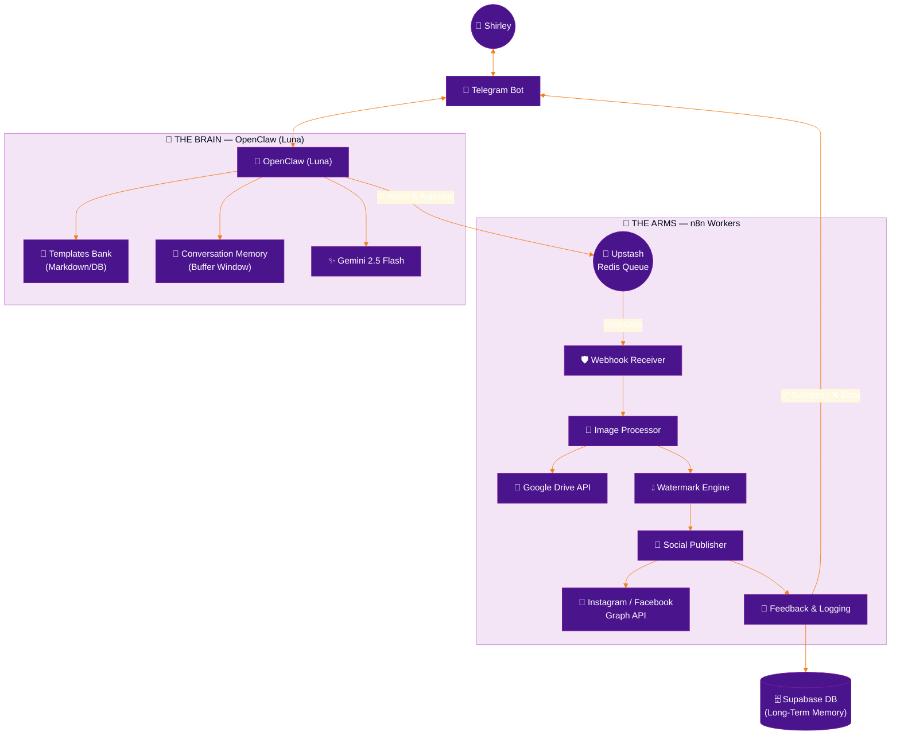
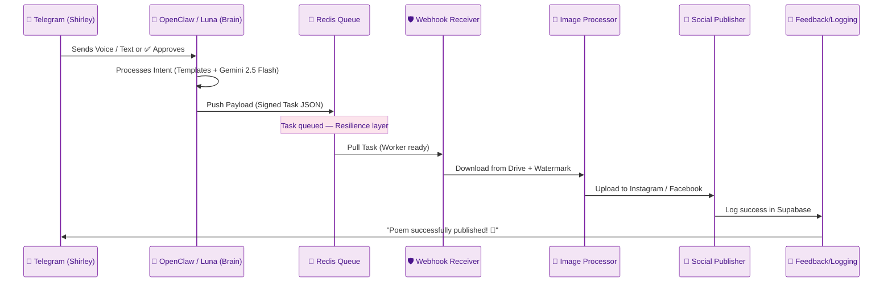
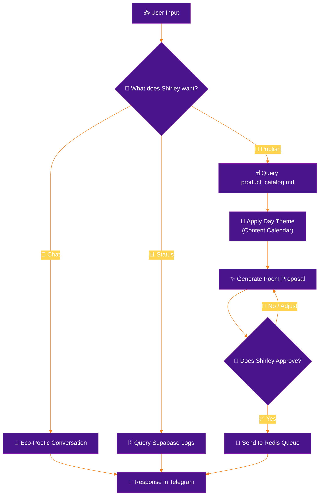

# System Architecture: Nenufar Marketing Automation
Version: v2.1
<!-- v2.1: Major architectural correction. Brain = OpenClaw (Luna) communicating via Telegram with Gemini. Optimization: Shifted from RAG to Templates Bank to save tokens. Arms = n8n Workers. -->

## Overview
The system follows a **Brain-Arms pattern**: **OpenClaw (Luna)** is the Brain — the cognitive agent that thinks, selects the best content strategy, and communicates with the user via Telegram using Gemini 2.5 Flash + **Templates Bank**. **n8n** is the Arms — the execution layer that handles mechanical tasks (image processing, publishing, logging) via workers orchestrated through Upstash Redis. This separation ensures intelligence stays in the agent while automation stays in the workflows.

---

## 1. System Topology

### 1.1 Visual Workflow Architecture (ASCII)
```text
╔═══════════════════════════════════════════════════════════════╗
║  🌸  NENUFAR — LUNA SYSTEM ARCHITECTURE v2.0  🌸            ║
╚═══════════════════════════════════════════════════════════════╝

 ┌─────────────────────────────────────────────────────────────┐
 │  🧠  THE BRAIN — OPENCLAW (LUNA)                           │
 │     AI Agent via Telegram · Gemini + Templates Bank        │
 │                                                             │
 │  ① LISTEN    Telegram Messages (Voice, Text, Media)         │
 │  ② THINK     Gemini 2.5 Flash + Templates Bank             │
 │  ③ CRAFT     "Poemas Tejidos" (Variable Interpolation)      │
 │  ④ INTERACT  Request Approval (Telegram ✅/🔄/❌ Buttons)   │
 │  ⑤ DISPATCH  Sign Payload (HMAC) → Push to Redis Queue     │
 └──────────────────────────┬──────────────────────────────────┘
                            │
          ┌─────────────────┼─────────────────┐
          │                 │                 │
          ▼                 ▼                 ▼
 ┌──────────────┐  ┌──────────────┐  ┌──────────────┐
 │  📱 TELEGRAM  │  │ 🗄️ SUPABASE  │  │  🔀 REDIS    │
 │  Bot API      │  │ (Memory/DB)  │  │  Queue       │
 └──────────────┘  └──────────────┘  └──────┬───────┘
                                             │
                                             ▼
 ┌─────────────────────────────────────────────────────────────┐
 │  🔀  MESSAGE BROKER — UPSTASH REDIS                         │
 │     Task Persistence · Worker Distribution · Retry Queue    │
 └──────────────────────────┬──────────────────────────────────┘
                            │
                            ▼
 ┌─────────────────────────────────────────────────────────────┐
 │  🦾  THE ARMS — n8n WORKERS                                 │
 │                                                             │
 │  [ 🛡️ RECEIVER  ]  Validate HMAC Signature                  │
 │  [ 🎨 PROCESSOR ]  Download from Drive + Sharp Watermark    │
 │  [ 📡 PUBLISHER ]  Meta Graph API (Instagram & Facebook)    │
 │  [ 📝 SCRIBE    ]  Log Status & Notify User (Supabase)      │
 └─────────────────────────────────────────────────────────────┘
```

### 1.2 High-Level Architecture (Mermaid)


---

## 2. Workflow Orchestration & Data Flow

### 2.1 Sequence of Execution (The Handshake)
This diagram shows how asynchronous processes communicate with each other to guarantee no task is lost.



### 2.2 Decision Logic: The Brain (Internal Luna Loop)
How Luna decides which action to take based on an incoming message.



---

## 3. Resilience & Reliability Improvements

To ensure enterprise-grade stability on a lightweight infrastructure, the following architectural patterns are implemented:

### 3.1 Dead Letter Queue (DLQ) & Retry Logic
- **Exponential Backoff:** If a worker fails (e.g., Meta API temporary downtime), the task is re-queued with increasing delays.
- **DLQ:** After 3 failed attempts, tasks are moved to a `dead_letter_queue` and OpenClaw notifies the user via Telegram for manual intervention.

### 3.2 Circuit Breakers for External APIs
- **Thresholds:** If the Meta Graph API returns >5 consecutive errors, the "Social Publisher" worker opens the circuit, pausing all publishing for 30 minutes to avoid account flagging.
- **Notification:** OpenClaw alerts the user via Telegram: "System paused due to Meta API instability."

### 3.3 State Recovery (Supabase as Source of Truth)
- **Persistence:** Even if the Redis queue is cleared, the `processed_files` table in Supabase tracks the status of every file.
- **Recovery Workflow:** A "Self-Healing" heartbeat checks for files in `processing` state for >1 hour and automatically re-queues them.

### 3.4 HMAC Signature Validation
- **Security:** Every payload sent from the Brain to the Arms is signed with a `WEBHOOK_SECRET`. Workers reject any unsigned or incorrectly signed requests, preventing unauthorized execution.

---

## 4. Agentic Intelligence & Decision Logic

The core of the system is the **Agentic Loop** — OpenClaw (Luna) acts as the Brain, making decisions and generating content, while n8n workers handle execution.

### 4.1 The Cognitive Engine — OpenClaw (Luna) + Gemini 2.5 Flash
- **Consistency:** OpenClaw uses the Templates Bank to ensure brand-aligned copy while saving tokens.
- **Multimodal Perception:** Luna "sees" images (via Drive metadata/previews) and "hears" voice notes (via transcription) to understand the full context of a marketing task.
- **Intent Classification:** Every message is classified into intents (Chat, Publish, Status, Help) before choosing the appropriate workflow path.
- **Communication:** OpenClaw interacts with Shirley exclusively via Telegram, serving as the conversational and creative interface.

### 4.2 The Execution Layer — n8n Workers
- **Mechanical Tasks:** Image processing (watermark, resize), social media publishing, and logging.
- **Resilience:** Workers operate independently, pulling tasks from Redis with retry logic and dead-letter queues.
- **Handshake:** OpenClaw dispatches signed payloads (HMAC) to the Redis queue; n8n workers validate and execute.

---

## 5. Core Components

### 5.1 The Brain — OpenClaw (Luna)
- **Role:** Central Intelligence and Creative Engine.
- **Interface:** Communicates with Shirley via Telegram (text, voice, media, approval buttons).
- **Cognition:** Gemini 2.5 Flash + Templates Bank for efficient and brand-aware content generation.
- **Workflow:**
    1. **Input:** Receives text, voice, or media from Telegram.
    2. **Transcription:** Uses Whisper/Gemini for voice-to-text.
    3. **Template Selection:** Selects the best template from `templates_bank.md` based on the product and theme.
    4. **Generation:** Crafts a "Woven Poem" caption following the `specs/brand_essence.md` and template guidelines.
    5. **Human-in-the-Loop:** Presents the content and media preview to Shirley for approval.
    6. **Dispatch:** Upon approval, sends a signed payload to the Redis Queue for n8n workers.

### 5.2 The Arms — n8n Workers
- **Environment:** n8n Instance on GCP (Docker, Queue Mode) + Upstash Redis.
- **Role:** Execution layer for all mechanical tasks.
- **Workers:**
    - **Webhook Receiver:** Validates HMAC signatures and pulls tasks from Redis.
    - **Image Processor:** Downloads media from Google Drive, resizes, and applies Nenufar watermark.
    - **Social Publisher:** Publishes to Instagram/Facebook via Meta Graph API.
    - **Feedback & Logging:** Persists metadata in Supabase and notifies OpenClaw via Telegram.

### 5.3 The Infrastructure (GCP + Supabase + Redis)
- **n8n (GCP e2-micro):** Dockerized instance running in Queue Mode.
- **Upstash Redis:** Message broker decoupling Brain from Arms.
- **Supabase:** Acts as the "Long-Term Memory" (LTM).
    - `processed_files`: Tracks every asset's lifecycle.
    - `content_calendar`: Stores the 7-day marketing strategy.
    - `monitoring_logs`: System health metrics.

---

## 5. Operational Modes & Lifecycle

### 5.1 Proactive Discovery Mode (Heartbeat Triggered)
- **Drive Scan:** `luna-drive-monitor` scans for new assets.
- **Strategy Alignment:** OpenClaw (Luna) queries the `content_calendar`.
- **Curation:** OpenClaw (Luna) selects and proposes content.

### 5.2 Lifecycle States Table

| State | Trigger | System Action | Output |
| :--- | :--- | :--- | :--- |
| **Pending** | Drive Sync | Record created in `processed_files` | Metadata in Supabase |
| **Drafting** | Heartbeat | OpenClaw generates caption proposal | Message in Telegram |
| **Processing**| User Approval| Redis Queue -> Image Processor | Watermarked image |
| **Publishing**| Worker Success| Social Publisher -> Meta API | Live post URL |
| **Logged** | Completion | Feedback & Logging Worker | Final confirmation |
