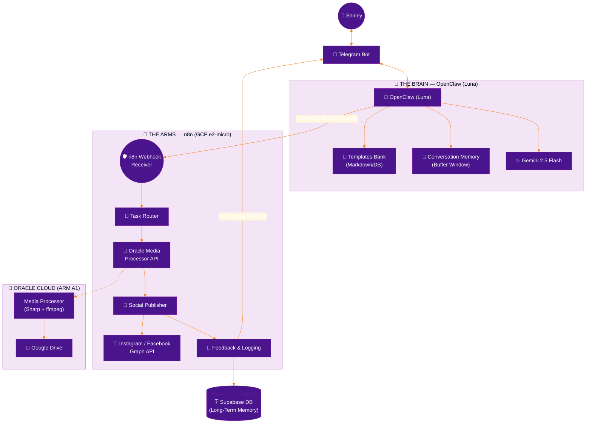
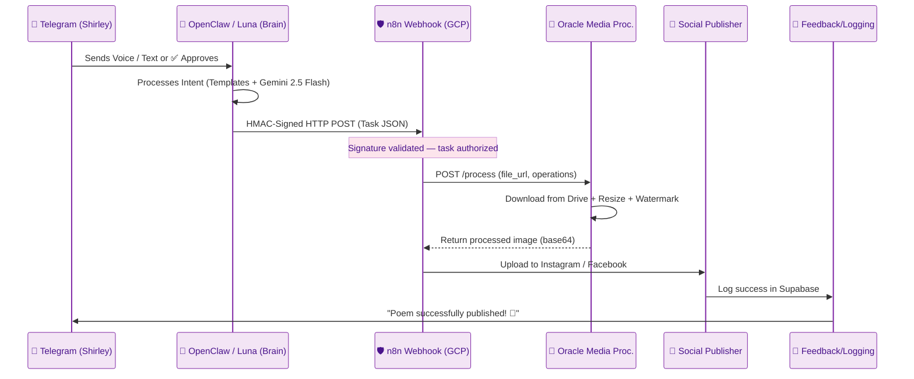
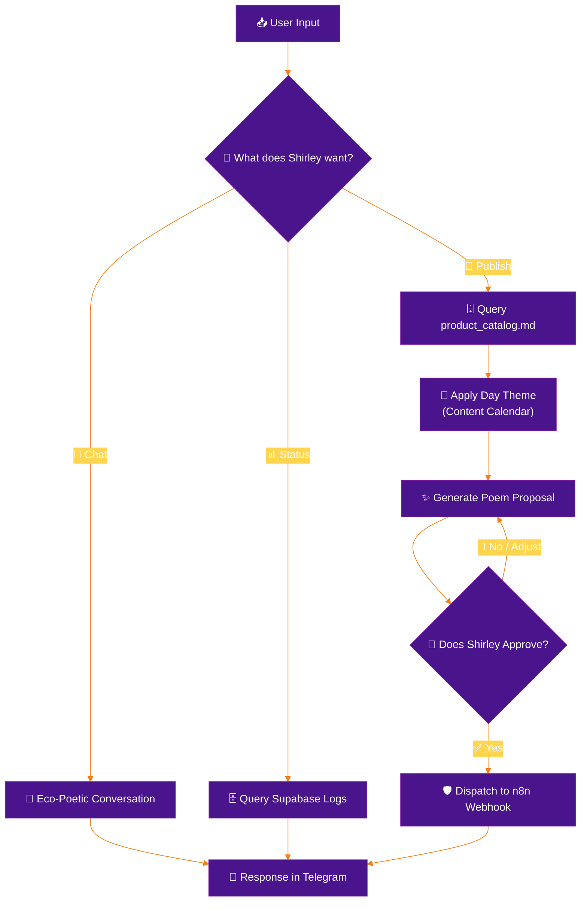

# System Architecture: Nenufar Marketing Automation
Version: v2.5
<!-- v2.5: Added Oracle Cloud Media Processor for heavy media operations (ADR-004). -->
<!-- v2.4: Removed Redis/Upstash — direct HMAC webhook architecture (ADR-003). -->
<!-- v2.3: Explicit Video support and Daily Scheduling flow. -->
<!-- v2.2: Added Proactive Hybrid Flow section. Optimized for token saving. -->
<!-- v2.1: Major architectural correction. Brain = OpenClaw (Luna) communicating via Telegram with Gemini. Optimization: Shifted from RAG to Templates Bank to save tokens. Arms = n8n Workers. -->

## Overview
The system follows a **Brain-Arms pattern**: **OpenClaw (Luna)** is the Brain — the cognitive agent that thinks, selects the best content strategy, and communicates with the user via Telegram using Gemini 2.5 Flash + **Templates Bank**. **n8n** is the Arms — the execution layer that handles mechanical tasks (media processing, publishing, logging) via direct HMAC-signed webhooks. This separation ensures intelligence stays in the agent while automation stays in the workflows.

---

## 1. System Topology

### 1.1 Visual Workflow Architecture (ASCII)
```text
╔═══════════════════════════════════════════════════════════════╗
║  🌸  NENUFAR — LUNA SYSTEM ARCHITECTURE v2.5  🌸            ║
╚═══════════════════════════════════════════════════════════════╝

 ┌─────────────────────────────────────────────────────────────┐
 │  🧠  THE BRAIN — OPENCLAW (LUNA)     [Oracle Cloud VM]     │
 │     AI Agent via Telegram · Gemini + Templates Bank        │
 │                                                             │
 │  ① LISTEN    Telegram Messages (Voice, Text, Media)         │
 │  ② THINK     Gemini 2.5 Flash + Templates Bank             │
 │  ③ CRAFT     "Poemas Tejidos" (Variable Interpolation)      │
 │  ④ INTERACT  Request Approval (Telegram ✅/🔄/❌ Buttons)   │
 │  ⑤ DISPATCH  Sign Payload (HMAC) → Direct Webhook to n8n   │
 └──────────────────────────┬──────────────────────────────────┘
                            │
          ┌─────────────────┼─────────────────┐
          │                 │                 │
          ▼                 ▼                 │
 ┌──────────────┐  ┌──────────────┐          │
 │  📱 TELEGRAM  │  │ 🗄️ SUPABASE  │          │
 │  Bot API      │  │ (Memory/DB)  │          │
 └──────────────┘  └──────────────┘          │
                                             │
               HMAC-Signed HTTP POST         │
                                             ▼
 ┌─────────────────────────────────────────────────────────────┐
 │  🦾  THE ARMS — n8n (GCP e2-micro) — Lightweight Router     │
 │                                                             │
 │  [ 🛡️ RECEIVER  ]  Validate HMAC Signature                  │
 │  [ 🔀 ROUTER    ]  Delegate heavy work to Oracle Worker     │
 │  [ 📡 PUBLISHER ]  Meta Graph API (Instagram & Facebook)    │
 │  [ 📝 SCRIBE    ]  Log Status & Notify User (Supabase)      │
 └──────────┬──────────────────────────────────────────────────┘
            │ HTTP POST /process
            ▼
 ┌─────────────────────────────────────────────────────────────┐
 │  💪  MEDIA PROCESSOR — Oracle Cloud (ARM A1)                │
 │     Sharp (images) · ffmpeg (video) · HMAC-secured API     │
 │                                                             │
 │  [ 📥 DOWNLOAD  ]  Fetch from Google Drive                  │
 │  [ 🎨 PROCESS   ]  Resize + Watermark + Format Conversion  │
 │  [ 📤 RETURN    ]  Base64 result → n8n                      │
 └─────────────────────────────────────────────────────────────┘
```

### 1.2 High-Level Architecture (Mermaid)


---

## 2. Workflow Orchestration & Data Flow

### 2.1 Sequence of Execution (The Handshake)
This diagram shows how asynchronous processes communicate with each other to guarantee no task is lost.



### 2.2 Decision Logic: The Brain (Internal Luna Loop)
How Luna decides which action to take based on an incoming message.



---

## 3. Resilience & Reliability Improvements

To ensure enterprise-grade stability on a lightweight infrastructure, the following architectural patterns are implemented:

### 3.1 Retry Logic & Error Recovery
- **Exponential Backoff:** If a worker fails (e.g., Meta API temporary downtime), n8n's built-in retry mechanism re-attempts with increasing delays.
- **Supabase as Recovery Layer:** After 3 failed attempts, the task status in `processed_files` is set to `failed` and OpenClaw notifies the user via Telegram for manual intervention. The Self-Healing heartbeat re-queues stuck tasks automatically.

### 3.2 Circuit Breakers for External APIs
- **Thresholds:** If the Meta Graph API returns >5 consecutive errors, the "Social Publisher" worker opens the circuit, pausing all publishing for 30 minutes to avoid account flagging.
- **Notification:** OpenClaw alerts the user via Telegram: "System paused due to Meta API instability."

### 3.3 State Recovery (Supabase as Source of Truth)
- **Persistence:** The `processed_files` table in Supabase tracks the status of every file as the single source of truth.
- **Recovery Workflow:** A "Self-Healing" heartbeat checks for files in `processing` state for >1 hour and automatically re-dispatches them via webhook.

### 3.4 HMAC Signature Validation
- **Security:** Every payload sent from the Brain to the Arms is signed with a `WEBHOOK_SECRET`. Workers reject any unsigned or incorrectly signed requests, preventing unauthorized execution.

---

## 4. Agentic Intelligence & Decision Logic

The core of the system is the **Agentic Loop** — OpenClaw (Luna) acts as the Brain, making decisions and generating content, while n8n workers handle execution.

### 4.1 The Cognitive Engine — OpenClaw (Luna) + Gemini 2.5 Flash
- **Consistency:** OpenClaw uses the Templates Bank to ensure brand-aligned copy while saving tokens.
- **Multimodal Perception:** Luna "sees" media (images/videos via Drive metadata/previews) and "hears" voice notes (via transcription) to understand the full context of a marketing task.
- **Intent Classification:** Every message is classified into intents (Chat, Publish, Status, Help) before choosing the appropriate workflow path.
- **Communication:** OpenClaw interacts with Shirley exclusively via Telegram, serving as the conversational and creative interface.

### 4.2 The Execution Layer — n8n Workers
- **Mechanical Tasks:** Media processing (watermark, resize), social media publishing, and logging.
- **Resilience:** Workers operate with built-in retry logic and Supabase-backed state recovery via the Self-Healing heartbeat.
- **Handshake:** OpenClaw dispatches signed payloads (HMAC) directly to n8n webhooks; n8n workers validate and execute.

---

## 5. Core Components

### 5.1 The Brain — OpenClaw (Luna)
- **Role:** Central Intelligence and Creative Engine.
- **Interface:** Communicates with Shirley via Telegram (text, voice, media, approval buttons).
- **Cognition:** Gemini 2.5 Flash + Templates Bank for efficient and brand-aware content generation.
- **Workflow:**
    1. **Input:** Receives text, voice, or media from Telegram.
    2. **Transcription:** Uses Whisper/Gemini for voice-to-text.
    3. **Template Selection:** Selects the best template from `templates_bank.md` based on the product and theme.
    4. **Generation:** Crafts a "Woven Poem" caption following the `specs/brand_essence.md` and template guidelines.
    5. **Human-in-the-Loop:** Presents the content and media preview to Shirley for approval.
    6. **Dispatch:** Upon approval, sends a signed payload (HMAC) directly to the n8n Webhook Receiver for execution.

### 5.2 The Arms — n8n (GCP e2-micro, Lightweight Router)
- **Environment:** n8n Instance on GCP (Docker, Regular Mode).
- **Role:** Lightweight orchestration layer — validates webhooks, routes tasks, delegates heavy processing to Oracle.
- **Workers:**
    - **Webhook Receiver:** Validates HMAC signatures on incoming webhook payloads.
    - **Task Router:** Delegates media processing to the Oracle Media Processor API via HTTP.
    - **Social Publisher:** Publishes to Instagram/Facebook via Meta Graph API.
    - **Feedback & Logging:** Persists metadata in Supabase and notifies OpenClaw via Telegram.
- **Key Principle:** The e2-micro instance never processes heavy media. All CPU/RAM-intensive operations are delegated to Oracle Cloud.

### 5.3 Media Processor — Oracle Cloud (ARM A1)
- **Environment:** Node.js micro-service on the same OCI VM as OpenClaw.
- **Role:** Heavy compute worker for all media operations.
- **Capabilities:**
    - **Image Processing:** Resize (1080x1350, 1080x1080, 1080x566), watermark (Nenufar logo at 15% opacity), format conversion (JPEG, PNG, WebP) via Sharp.
    - **Video Processing (Future):** Compression, resize, codec optimization via ffmpeg.
- **Security:** HMAC signature validation on every request (same `WEBHOOK_SECRET`).
- **API Contract:** See `specs/media_processor_api.md` for full endpoint specification.

### 5.4 The Infrastructure (GCP + OCI + Supabase)
- **n8n (GCP e2-micro):** Dockerized instance running in Regular Mode. Lightweight router only.
- **Media Processor (OCI ARM A1):** Node.js API for heavy media processing. Shares VM with OpenClaw.
- **Supabase:** Acts as the "Long-Term Memory" (LTM) and source of truth for task state.
    - `processed_files`: Tracks every asset's lifecycle.
    - `content_calendar`: Stores the 7-day marketing strategy.
    - `monitoring_logs`: System health metrics.

---

## 5. Operational Modes & Lifecycle

### 5.1 Proactive Discovery Mode (Heartbeat Triggered)
- **Drive Scan:** `luna-drive-monitor` scans for new assets.
- **Strategy Alignment:** OpenClaw (Luna) queries the `content_calendar`.
- **Curation:** OpenClaw (Luna) selects and proposes content.

### 5.2 Lifecycle States Table

| State | Trigger | System Action | Output |
| :--- | :--- | :--- | :--- |
| **Pending** | Drive Sync | Record created in `processed_files` | Metadata in Supabase |
| **Drafting** | Heartbeat | OpenClaw generates caption proposal | Message in Telegram |
| **Processing**| User Approval| n8n -> Oracle Media Processor | Watermarked media |
| **Publishing**| Worker Success| Social Publisher -> Meta API | Live post URL |
| **Logged** | Completion | Feedback & Logging Worker | Final confirmation |

---

## 6. Content Freshness Engine

To ensure that automated content remains varied and engaging without repetitive patterns, the system utilizes a **Content Freshness Engine** composed of four strategic pillars:

### 6.1 Real Inventory Integration (Drive Sync)
Luna does not guess what to publish. By analyzing the filenames and metadata of new media uploaded to Google Drive (e.g., `aretes_telar_rojo.jpg`), the system extracts the actual materials, colors, and techniques currently in stock. This ensures the narrative is always grounded in real, available products.

### 6.2 Seasonal & Temporal Context
During the workflow execution, n8n injects the current date and upcoming seasonal events (e.g., Mother's Day, Holy Week in Cartagena) as context for Gemini. This allows Luna to adapt the `{{day_theme}}` variable with timely and relevant narratives.

### 6.3 Forced Template Rotation
The system tracks every published post in the `nenufar.content_calendar` table, including the `template_id` used. Before selecting a new template, Luna queries this history to ensure that the same structure is not repeated within a 7-day window, forcing a variety of "emotions" and "formats."

### 6.4 The Weekly Seed (Human-in-the-Loop)
Every week (e.g., Sunday night), the user provides a short voice or text note via Telegram (the `/seed` command). This "Seed" sets the creative focus for the next 7 days (e.g., "focus on the ocean and Marta's patience"). This context is stored in Supabase and influences every caption generated that week, ensuring a unique, human-led narrative that changes over time.

---

## 7. Proactive Hybrid Flow (Token Optimization)

To maintain a balance between magical automation and operational cost, the system implements a hybrid flow that minimizes the use of token-heavy Vision AI:

### 7.1 Event-Driven Detection
n8n monitors Google Drive folders. When a new file is detected, it does **not** automatically send the media to Gemini. Instead, it triggers a lightweight notification to Luna.

### 7.2 Interactive Classification
Luna sends a message to Shirley via Telegram: *"I've seen a new photo or video! Is this a [Necklace], [Earring], or [Bracelet]?"* Using interactive buttons, Shirley classifies the asset. This provides 100% accurate metadata at a fraction of the cost of multimodal analysis.

### 7.3 Strategic Scheduling (The Chronological Arms)
Approval does not mean immediate publication. n8n workers check the `content_calendar` and the current day's optimal posting hours. Approved tasks are dispatched to n8n with a "scheduled_at" timestamp, ensuring the post goes live when engagement is highest.

### 7.4 Pipeline Heartbeat (Proactivity)
Once a day (e.g., 9:00 AM), n8n triggers the Discovery Mode. If the `content_calendar` shows no scheduled posts for the next 24 hours and no new media was detected in Drive, Luna proactively reaches out to Shirley: *"🌸 Shirley, I don't have anything scheduled for today and didn't see new creations in the folder. Do you have any new pieces you'd like me to weave a poem for?"*
